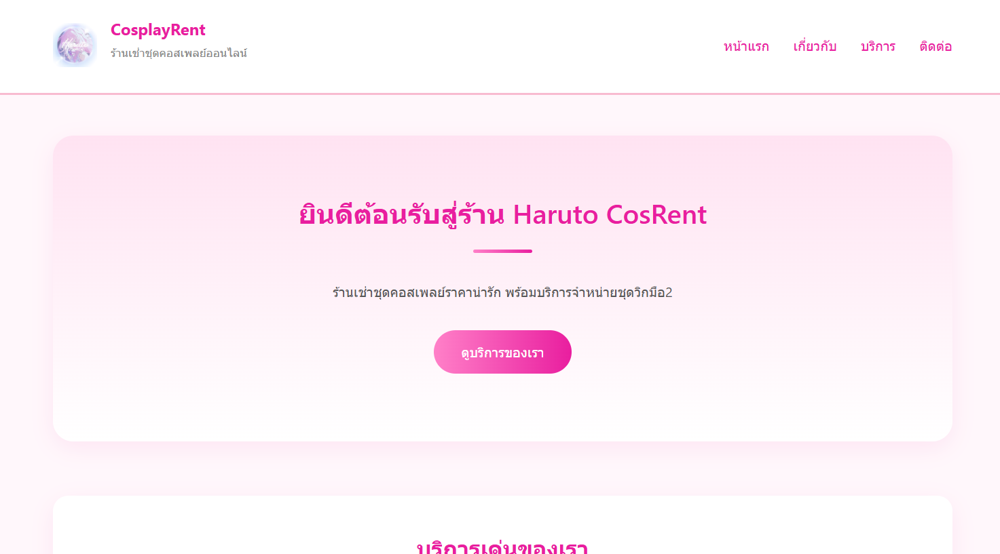
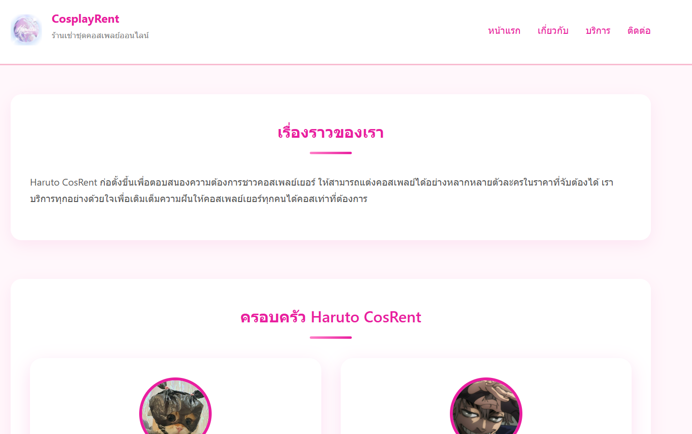
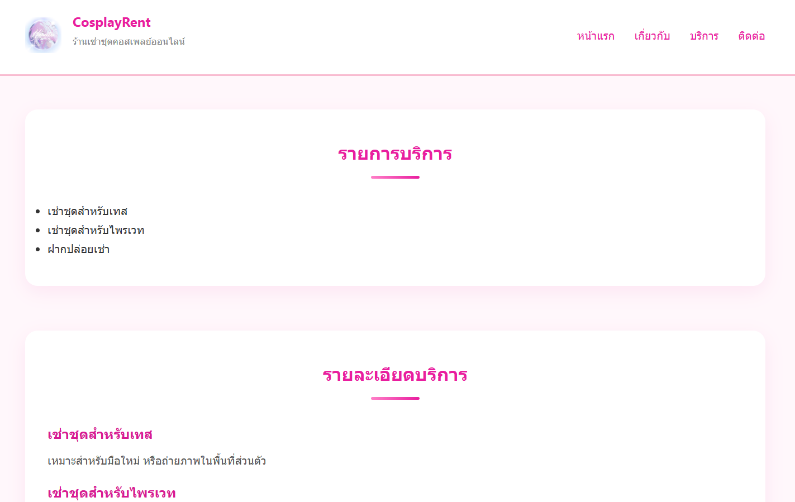
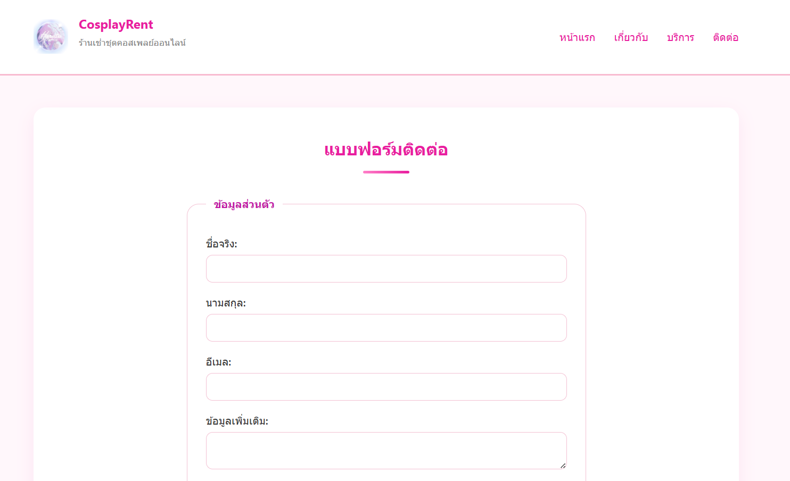

# 🎀 Haruto CosRent — CSS Styled Business Website

Assignment #2: CSS Styling for Business Website

โปรเจกต์นี้เป็นการพัฒนาต่อยอดจาก Assignment #1  
โดยนำความรู้จาก CSS Fundamentals, Flexbox, Grid และ Responsive Design  
มาประยุกต์ใช้เพื่อปรับปรุงรูปแบบเว็บไซต์ธุรกิจให้มีความสวยงาม ทันสมัย  
และรองรับการแสดงผลบนหลายขนาดหน้าจอ

---

## 🧵 คำอธิบายโปรเจกต์

Haruto CosRent คือเว็บไซต์ร้านเช่าชุดคอสเพลย์ออนไลน์  
ให้บริการเช่าชุดสำหรับเทส, เช่าสำหรับไพรเวท และบริการฝากปล่อยเช่า  
เว็บไซต์ถูกออกแบบให้มีโครงสร้างชัดเจน ใช้งานง่าย  
และเพิ่มประสบการณ์ผู้ใช้ด้วย CSS Styling และ Interaction Effects

---

## 🎯 วัตถุประสงค์ของ Assignment

- ฝึกใช้ CSS Selectors และ Box Model
- ฝึกจัด Layout ด้วย Flexbox และ CSS Grid
- ฝึก Responsive Web Design
- ฝึกสร้าง Component ที่สามารถนำกลับมาใช้ซ้ำได้
- เพิ่ม Hover Effects และ Transition
- จัดโครงสร้างไฟล์ CSS อย่างเป็นระบบ

---

## 🛠️ เทคโนโลยีที่ใช้

- HTML5
- CSS3
- Flexbox
- CSS Grid
- Media Queries
- Google Maps Embed

---

## 📁 โครงสร้างไฟล์โปรเจกต์

```text
my-business-web
├── index.html
├── about.html
├── services.html
├── contact.html
├── css/
│   └── styles.css
├── images/
│   ├── logo.png
│   ├── you.jpg
│   ├── me.jpg
│   ├── screen-index.png
│   ├── screen-index-after.png
│   ├── screen-about.png
│   ├── screen-about-after.png
│   ├── screen-services.png
│   ├── screen-services-after.png
│   ├── screen-contact.png
│   └── screen-contact-after.png
└── README.md
```

---

# 🖥️ เปรียบเทียบหน้าเว็บไซต์ (Before / After CSS)

---

## ⭐ หน้าแรก (index.html)

### 🔹 ก่อนปรับ CSS

- โครงสร้างพื้นฐาน
- ยังไม่มี Layout ที่ชัดเจน
- ไม่มี Hero Section และ Card Styling


### 🔹 หลังปรับ CSS

- Sticky Navigation Bar
- Hero Section พร้อม Gradient Background
- Cards แสดงบริการเด่น
- Hover Effects และ Responsive Layout



---

## 📘 หน้าเกี่ยวกับ (about.html)

### 🔹 ก่อนปรับ CSS

- แสดงข้อมูลแบบเรียงตามลำดับ
- ทีมงานยังไม่มีรูปแบบ Card
- Layout ยังไม่เด่นชัด


### 🔹 หลังปรับ CSS

- จัด Section ชัดเจน
- Team Section แบบ Card ด้วย CSS Grid
- รูปภาพทีมงานจัดวางสวยงาม
- Responsive ตามขนาดหน้าจอ



---

## 🛍️ หน้าบริการ (services.html)

### 🔹 ก่อนปรับ CSS

- แสดงข้อมูลเป็นข้อความและตารางพื้นฐาน
- ยังไม่มีการเน้นข้อมูลสำคัญ


### 🔹 หลังปรับ CSS

- ตารางแพ็กเกจมีสีและการแบ่งชัดเจน
- ใช้ Hover Effect บนแถวตาราง
- อ่านง่ายและดูเป็นเว็บไซต์ธุรกิจมากขึ้น



---

## 📞 หน้าติดต่อ (contact.html)

### 🔹 ก่อนปรับ CSS

- ฟอร์มแสดงผลแบบพื้นฐาน
- Layout ยังไม่เป็นระเบียบ


### 🔹 หลังปรับ CSS

- ฟอร์มจัด Layout อย่างเป็นระเบียบ
- Input และ Button มี Styling
- แผนที่ Google Maps แสดงผลสวยงาม
- รองรับ Responsive Design



---

## 🎨 CSS Features ที่ใช้

- CSS Reset
- Element / Class / ID Selectors
- Pseudo-classes (:hover, :focus, :nth-child)
- Responsive Units (rem, %, vh, vw)
- Flexbox และ CSS Grid
- Sticky Header
- Hover Effects & Transitions
- Media Queries

---

## 📱 Responsive Design

เว็บไซต์สามารถแสดงผลได้ดีบน
คอมพิวเตอร์ แท็บเล็ต และโทรศัพท์มือถือ
โดยมีการปรับ Layout และขนาดตัวอักษรอัตโนมัติ

---

## 👩‍🎓 ผู้จัดทำ

น.ส. ฟาร่า มิมมา — 67160406
คณะวิทยาการสารสนเทศ
มหาวิทยาลัยบูรพา
