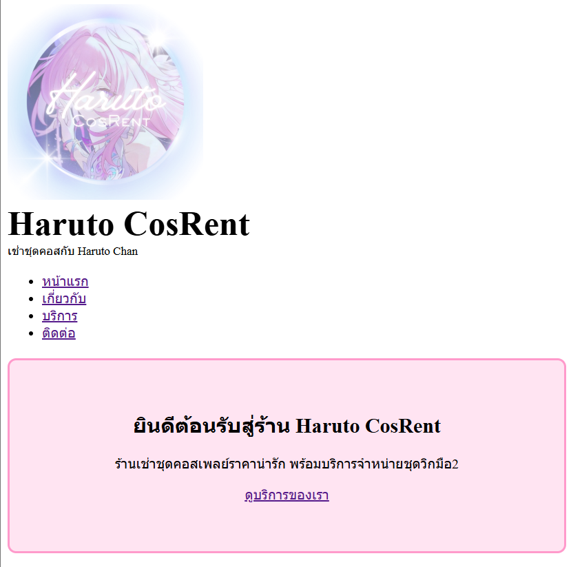
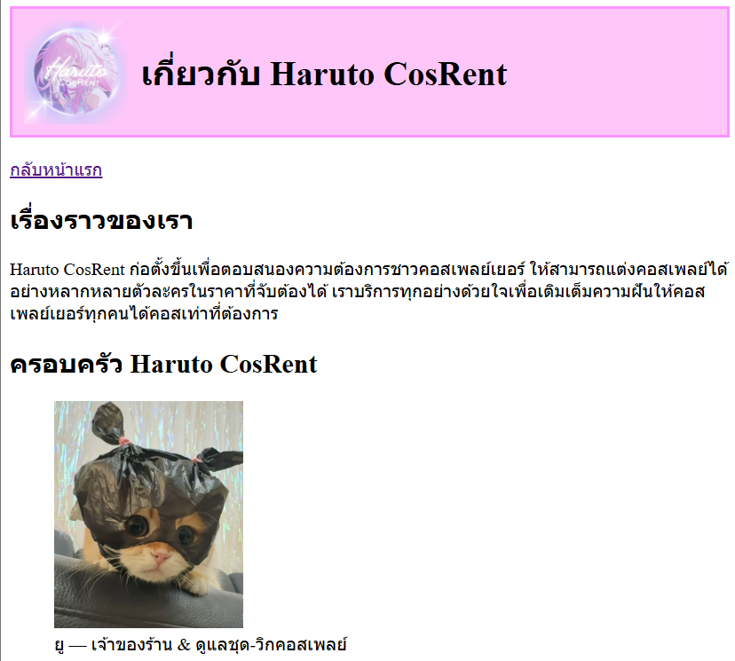
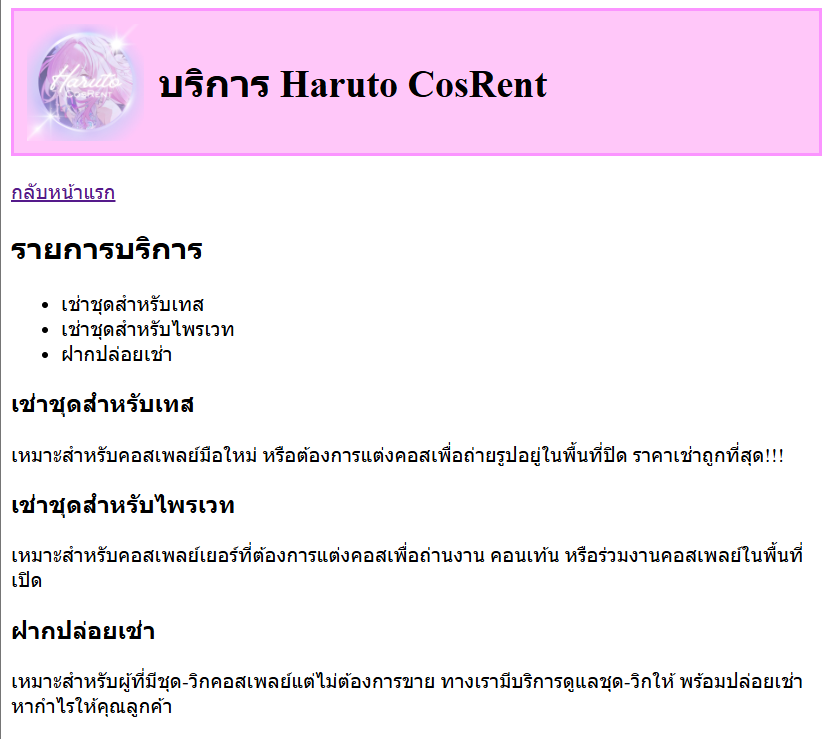
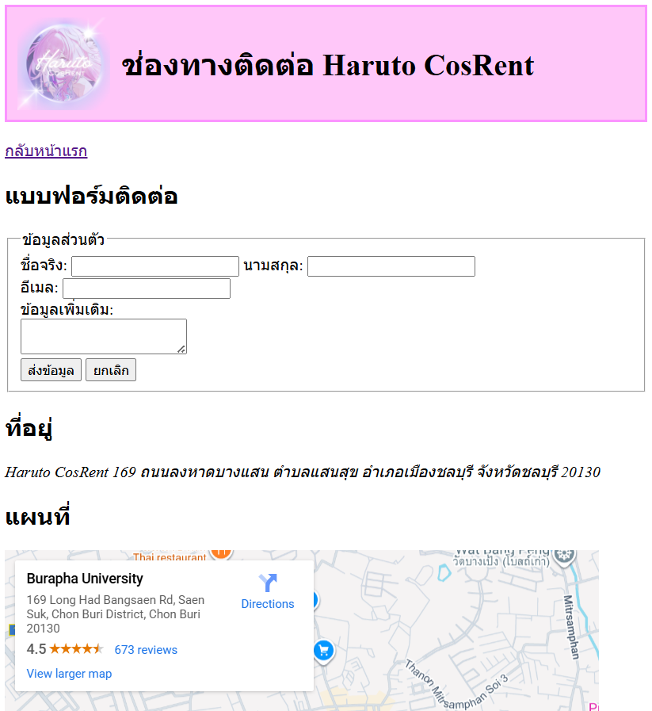

# Haruto CosRent — เว็บไซต์เช่าชุดคอสเพลย์ออนไลน์

โปรเจกต์นี้เป็นเว็บไซต์ของ **Haruto CosRent** ร้านเช่าชุดคอสเพลย์ออนไลน์ ที่ให้บริการเช่าชุดสำหรับเทส, เช่าสำหรับไพรเวท และบริการฝากปล่อยเช่า รวมถึงมีหน้าแสดงข้อมูลร้าน เรื่องราวทีมงาน และช่องทางติดต่อครบถ้วน

เว็บไซต์ประกอบด้วย 4 หน้า ได้แก่ **หน้าแรก**, **เกี่ยวกับ**, **บริการ**, และ **ติดต่อเรา** พร้อมรูปภาพ โลโก้ ตารางบริการ ฟอร์มกรอกข้อมูล และแผนที่ร้าน

---

## 📁 โครงสร้างไฟล์ (Project Structure)

my-business-web
├── index.html
├── about.html
├── services.html
├── contact.html
├── images/
│ ├── logo.png
│ ├── you.jpg
│ ├── me.jpg
│ ├── Banner.png
│ ├── screen-index.png
│ ├── screen-about.png
│ ├── screen-services.png
│ ├── screen-contact.png
└── README.md

---

# 🖥️ รายละเอียดแต่ละหน้า (Page Description)

## ⭐ หน้าแรก — `index.html`

**สิ่งที่แสดง:**

- โลโก้ร้าน + ชื่อ Haruto CosRent
- แถบนำทางไปยังหน้าอื่น (About / Services / Contact)
- Hero Section พร้อมข้อความต้อนรับ
- บริการเด่น 3 รายการ
- Footer พร้อมลิงก์เมนู

**ภาพหน้าเว็บ:**  

---

## 📘 หน้าเกี่ยวกับ — `about.html`

**สิ่งที่แสดง:**

- เรื่องราวของร้าน Haruto CosRent
- ทีมงาน (รูปภาพ + ชื่อ + บทบาท)
- Mission & Vision
- ลิงก์กลับหน้าแรก

**ภาพหน้าเว็บ:**  

---

## 🛍️ หน้าบริการ — `services.html`

**สิ่งที่แสดง:**

- รายการบริการหลัก 3 รายการ
- รายละเอียดของแต่ละบริการแบบแยก Section
- ตารางเปรียบเทียบแพ็กเกจเช่าชุด
  - ระยะเวลาเช่า
  - การรวมพร็อพ
  - รองรับพื้นที่ใช้งาน
  - นัดรับ
  - ราคาโดยประมาณ

**ภาพหน้าเว็บ:**  

---

## 📞 หน้าติดต่อ — `contact.html`

**สิ่งที่แสดง:**

- ฟอร์มติดต่อ (ใช้ input + textarea + validation)
- ที่อยู่ร้าน
- แผนที่ร้าน (Google Maps Embed)
- ลิงก์กลับหน้าแรก

**ภาพหน้าเว็บ:**  

---

# 🔗 ลิงก์ไปยังแต่ละหน้า

- หน้าแรก — `index.html`
- เกี่ยวกับ — `about.html`
- บริการ — `services.html`
- ติดต่อ — `contact.html`

---

# ✔️ สรุปโปรเจกต์

เว็บไซต์ **Haruto CosRent** ถูกจัดทำขึ้นเพื่อแสดงบริการเช่าชุดคอสเพลย์อย่างครบถ้วน ใช้งานง่าย มีโครงสร้างไฟล์เป็นระเบียบ พร้อมรูปภาพและข้อมูลสำคัญทุกหน้า รองรับการนำเสนอและการส่งงานในรายวิชาได้อย่างสมบูรณ์

---

# 👩‍🎓 ผู้จัดทำ

**น.ส. ฟาร่า มิมมา — 67160406**  
คณะวิทยาการสารสนเทศ  
มหาวิทยาลัยบูรพา
